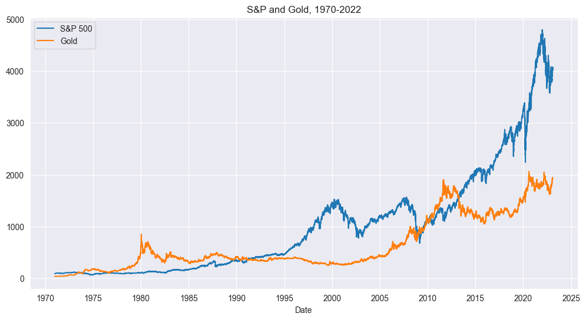
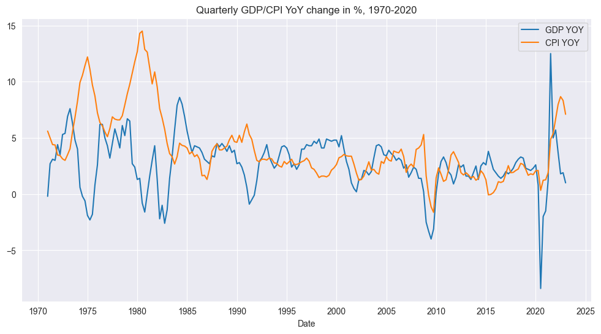
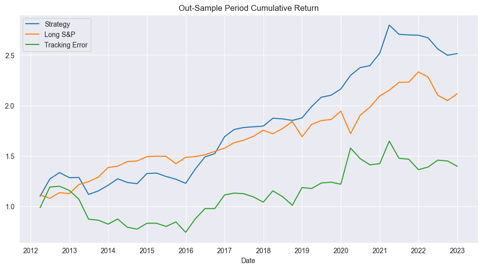
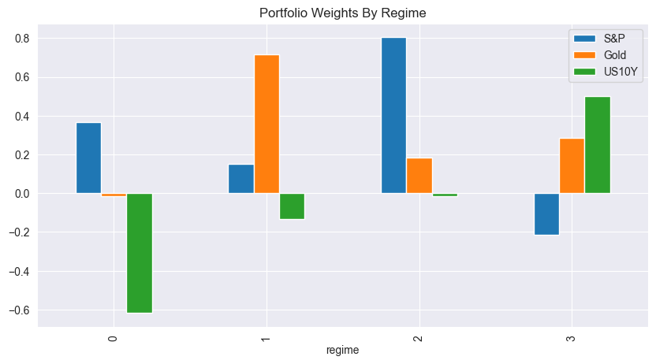

## S&P Macro Regime Strategy

* Project Structure
    * Backtest and strategy: `economic_regime_avm.ipynb`
    * Helper files: `macro_utils.py`
    * Data: `data.xlsx`
* Description
    * A project ([post here](https://ryan-chew.com/sp_macro_strategy.html)) to come up with a strategy to beat long S&P based on rebalancing SPX, Gold, and US10Y based on macro conditions. 
    * Went with quarterly rebalancing over based on regimes of rising/falling growth/inflation from GDP/CPI data.
    * Classified in-sample period into regime quadrants, calculate Sharpes of each instrument for each regime to use as an alpha for portfolio weights.

 
 

S&P vs Gold

 

Year on year changes in GDP/CPI.

 

Out-sample returns of rebalancing strategy.

 

Signals for portfolio weights in each regime.

